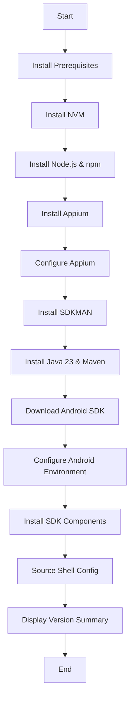

# Workshop Environment Setup Documentation

## Overview

This documentation covers the complete setup environment for the mobile testing workshop, including:
- Automated environment setup script (`setup_environment.sh`)
- Docker containerized environment (`Dockerfile`)
- Configuration files and dependencies
- Build and deployment instructions

---

## Table of Contents

1. [Architecture Overview](#architecture-overview)
2. [Setup Script (`setup_environment.sh`)](#setup-script-setup_environmentsh)
3. [Docker Configuration](#docker-configuration)
4. [Appium Configuration](#appium-configuration)
5. [Build Instructions](#build-instructions)
6. [Usage Instructions](#usage-instructions)
7. [Troubleshooting](#troubleshooting)

---

## Architecture Overview

The workshop environment provides a complete mobile testing stack with the following components:

### Core Components

| Component | Version | Purpose |
|-----------|---------|---------|
| **Ubuntu** | 22.04 | Base operating system |
| **Node.js** | Latest LTS | JavaScript runtime for Appium |
| **NVM** | 0.39.5 | Node Version Manager |
| **Appium** | Latest | Mobile automation framework |
| **Java** | 23 (OpenJDK) | Required for Android SDK tools |
| **Maven** | 3.9.5 | Build automation tool |
| **Android SDK** | Latest | Android development tools |
| **SDKMAN** | Latest | Java/Maven version manager |

### Directory Structure

```
workshop_setup/
├── setup_environment.sh       # Unified installation script
├── start-appium.sh            # Appium server startup script with validation
├── appium.conf.json          # Appium server configuration
├── Dockerfile                # Docker container definition (runs setup at build time)
├── SETUP_DOCUMENTATION.md    # This file
├── README.md                 # Quick start guide
└── legacy/                   # Legacy installation scripts
    ├── install_android_sdk.sh
    ├── install_tools.sh
    ├── README.md
    └── Dockerfile
```

---

## Setup Script (`setup_environment.sh`)

### Purpose

The `setup_environment.sh` script is a unified, automated installation script that sets up the complete workshop environment. It can be used both:
- **Inside Docker containers** (automated during container build time)
- **On bare metal Ubuntu machines** (manual installation)

### Output Functions

The script uses color-coded emoji output for better readability:

```bash
# Color definitions
RED=$(tput setaf 1)      # Error messages
GREEN=$(tput setaf 2)    # Success messages
YELLOW=$(tput setaf 3)   # Warning messages
BLUE=$(tput setaf 4)     # Info messages

# Helper functions
ok()    # ✔ Green checkmark for success
warn()  # ⚠ Yellow warning symbol
error() # ✖ Red X for errors
info()  # ℹ Blue info symbol
```

### Script Flow



### Key Functions

#### 1. **Prerequisites Installation** (`install_prerequisites`)

```bash
# Installs essential tools
- curl (for downloading)
- wget (for downloading)
- unzip (for extracting archives)
```

**Features:**
- Auto-detects package manager (apt-get/yum)
- Uses sudo for system-wide installation
- Validates each tool after installation

#### 2. **NVM Installation** (`install_nvm`)

```bash
# Installs Node Version Manager
- Downloads from official GitHub repository
- Configures shell integration (.bashrc/.zshrc)
- Loads NVM in current session
```

**Why NVM?**
- Allows easy Node.js version switching
- User-level installation (no sudo needed)
- Automatically manages npm versions

#### 3. **Node.js & npm** (`install_node_and_npm`)

```bash
# Installs latest LTS Node.js
- Uses NVM to install Node.js
- Automatically includes npm
- Verifies installation
```

#### 4. **Appium Installation** (`install_appium`)

```bash
# Installs Appium globally
- Uses npm for installation
- Installs latest stable version
- Verifies command availability
```

#### 5. **Appium Configuration** (`configure_appium`)

```bash
# Configures Appium with custom settings
- Creates ~/.appium directory
- Copies appium.conf.json
- Creates chromedriver storage directory
```

**Configuration Details:**
- Config location: `~/.appium/appium.conf.json`
- Chromedriver storage: `~/secugrow/chromedrivers`
- Automatically picked up by Appium server

#### 6. **SDKMAN Installation** (`install_sdkman`)

```bash
# Installs SDKMAN for Java/Maven management
- Downloads from official source
- Configures shell integration
- Loads SDKMAN in current session
```

**Why SDKMAN?**
- Manages multiple Java versions
- User-level installation
- Easy version switching
- Includes Maven management

#### 7. **Java & Maven Installation** (`install_maven_and_java`)

```bash
# Installs Java 23 and Maven 3.9.5
- Uses SDKMAN for installation
- Sets Java 23 as default
- Configures JAVA_HOME
- Verifies installations
```

**Java Version:**
- Java 23.0.2-librca (LibericaJDK)
- Required for Android SDK tools
- Automatically configured in PATH

#### 8. **Android SDK Download** (`download_and_extract_sdk`)

```bash
# Downloads and extracts Android SDK
- Fetches latest version from Google repository
- Falls back to known version if fetch fails
- Extracts to proper directory structure
```

**SDK Structure:**
```
android_sdk/
└── cmdline-tools/
    └── latest/
        ├── bin/
        │   └── sdkmanager
        └── lib/
```

**Version Detection:**
- Queries Google's repository2-3.xml
- Automatically gets latest commandlinetools
- Fallback version: 11076708

#### 9. **Android Environment Configuration** (`configure_android_environment`)

```bash
# Configures Android environment variables
- Detects shell type (bash/zsh)
- Adds ANDROID_SDK_ROOT to shell config
- Configures PATH for Android tools
```

**Environment Variables Set:**
```bash
ANDROID_SDK_ROOT=<pwd>/android_sdk
ANDROID_CMDLINE_TOOLS=$ANDROID_SDK_ROOT/cmdline-tools/latest
ANDROID_PLATFORM_TOOLS=$ANDROID_SDK_ROOT/platform-tools
ANDROID_BUILD_TOOLS=$(ls -d $ANDROID_SDK_ROOT/build-tools/* 2>/dev/null | head -1)
PATH=$ANDROID_CMDLINE_TOOLS/bin:$ANDROID_PLATFORM_TOOLS:$ANDROID_BUILD_TOOLS:$PATH
```

#### 10. **SDK Components Installation** (`install_sdk_components`)

```bash
# Installs required Android SDK components
- platform-tools (adb, fastboot)
- platforms;android-33 (Android 13 platform)
- build-tools (latest version detected automatically)
```

**Process:**
- Sources SDKMAN to access Java
- Queries sdkmanager to get latest build-tools version
- Falls back to version 34.0.0 if detection fails
- Runs sdkmanager with auto-accept
- Exports build-tools version for later use
- Verifies installation success

**Dynamic Version Detection:**
The script automatically detects and installs the latest available build-tools version instead of hardcoding a version number.

### Shell Detection

The script automatically detects the user's shell and configures the appropriate file:

| Shell | Config File | Priority |
|-------|-------------|----------|
| **bash** (Linux) | `~/.bashrc` | Primary |
| **bash** (Linux) | `~/.profile` | Fallback |
| **zsh** | `~/.zshrc` | Primary |
| **Other** | `~/.bashrc` | Default |

### Error Handling

```bash
set -e  # Exit on any error
```

**Safety Features:**
- Exits immediately on command failure
- Validates each installation step
- Provides clear error messages
- Checks prerequisites before proceeding

### Version Summary Output

At the end of execution, the script displays:

```
======================================
    Installed Component Versions
======================================

Node.js:     v22.x.x
npm:         10.x.x
Appium:      2.x.x
Java:        openjdk 23.0.2
Maven:       Apache Maven 3.9.5
Android SDK: Installed at /path/to/android_sdk

======================================
```

---

## Appium Startup Script (`start-appium.sh`)

### Purpose

The `start-appium.sh` script is the container entry point that automatically starts the Appium server with proper environment configuration and validation.

### Script Features

#### Environment Loading
```bash
# Load all environment configurations
source ~/.bashrc
source ~/.nvm/nvm.sh 
source ~/.sdkman/bin/sdkman-init.sh
```

#### Pre-flight Validation
- **Appium availability check**: Verifies Appium is installed and accessible
- **Driver validation**: Lists all installed drivers and specifically checks for UIAutomator2
- **Configuration display**: Shows the contents of appium.conf.json if present
- **Error handling**: Provides detailed error messages if components are missing

#### Automatic Server Startup
- **Configuration detection**: Automatically loads ~/.appium/appium.conf.json if present
- **Fallback parameters**: Uses command-line parameters if no config file found
- **Network binding**: Starts server on 0.0.0.0 to accept external connections
- **Process replacement**: Uses `exec` to replace the script process with Appium server

### Script Output Example
```
✓ Appium found: 3.1.0
Checking installed Appium drivers...
✓ UIAutomator2 driver is installed
✓ Found Appium configuration file: /home/appiumuser/.appium/appium.conf.json
Configuration contents:
{
  "server": {
    "port": 4723,
    "allow-cors": true,
    ...
  }
}
--- End of configuration ---
Starting Appium server with configuration file (auto-loaded)...
[Appium] Welcome to Appium v3.1.0
```

---

## Docker Configuration

### Dockerfile Overview

The `Dockerfile` creates a complete Ubuntu environment with all tools pre-installed at build time, and includes an automatic Appium server startup script.

### Dockerfile Breakdown

```dockerfile
FROM ubuntu:22.04
```
**Base Image:** Ubuntu 22.04 LTS (Jammy Jellyfish)
- Long-term support until 2027
- Stable package repositories
- Wide compatibility

---

```dockerfile
ENV DEBIAN_FRONTEND=noninteractive
```
**Purpose:** Prevents interactive prompts during package installation
- Essential for automated builds
- Prevents build hanging on user input

---

```dockerfile
RUN apt-get update && apt-get install -y \
    curl \
    wget \
    unzip \
    zip \
    sudo \
    bash \
    ca-certificates \
    git \
    && rm -rf /var/lib/apt/lists/*
```
**Package Installation:**
- `curl`, `wget`: Download tools
- `unzip`, `zip`: Archive utilities (required for SDKMAN)
- `sudo`: Privilege escalation
- `bash`: Shell (some scripts require bash features)
- `ca-certificates`: SSL/TLS certificates for HTTPS
- `git`: Version control (optional, for future use)

**Cleanup:** `rm -rf /var/lib/apt/lists/*` reduces image size

---

```dockerfile
RUN useradd -m -s /bin/bash appiumuser && \
    echo "appiumuser ALL=(ALL) NOPASSWD: ALL" >> /etc/sudoers
```
**User Creation:**
- Creates non-root user `appiumuser`
- `-m`: Creates home directory
- `-s /bin/bash`: Sets bash as default shell
- Grants passwordless sudo access

**Security Note:** This is for workshop/testing only. Production environments should use proper authentication.

---

```dockerfile
WORKDIR /home/appiumuser
```
**Working Directory:** Sets default directory for subsequent commands and container entry point

---

```dockerfile
COPY setup_environment.sh start-appium.sh appium.conf.json ./
```
**File Copying:**
- Copies setup script to container
- Copies Appium startup script to container
- Copies Appium configuration
- Files owned by root initially

---

```dockerfile
RUN chmod +x setup_environment.sh start-appium.sh && \
    chown appiumuser:appiumuser setup_environment.sh start-appium.sh appium.conf.json
```
**Permissions:**
- Makes both scripts executable
- Changes ownership to appiumuser
- Ensures user can read config file

---

```dockerfile
USER appiumuser
```
**Switch User:** All subsequent commands run as `appiumuser`, not root

**Security Benefit:** Limits potential damage from vulnerabilities

---

```dockerfile
RUN ./setup_environment.sh
```
**Build-Time Setup:**
- Runs the complete setup script during `docker build`
- Installs NVM, Node.js, Appium, SDKMAN, Java, Maven, Android SDK
- All tools baked into the image
- Container startup is instant

**Why at build time?**
- ✅ Faster container startup (no setup delay)
- ✅ Consistent environment (setup runs once)
- ✅ Easier debugging (build fails early if issues)
- ❌ Larger image size (~2-3GB)

---

```dockerfile
ENV NVM_DIR=/home/appiumuser/.nvm \
    SDKMAN_DIR=/home/appiumuser/.sdkman \
    ANDROID_SDK_ROOT=/home/appiumuser/android_sdk
```
**Environment Variables:**
- Sets paths for installed tools
- Makes tools accessible in container
- Required for interactive shells

---

```dockerfile
ENV PATH="${NVM_DIR}/versions/node/$(ls ${NVM_DIR}/versions/node 2>/dev/null | head -1)/bin:${SDKMAN_DIR}/candidates/java/current/bin:${ANDROID_SDK_ROOT}/cmdline-tools/latest/bin:${ANDROID_SDK_ROOT}/platform-tools:$(ls -d ${ANDROID_SDK_ROOT}/build-tools/* 2>/dev/null | head -1):${PATH}"
```
**PATH Configuration:**
- Adds Node.js binaries (dynamically determined version)
- Adds Java binaries from SDKMAN
- Adds Android SDK tools (cmdline-tools, platform-tools)
- Adds build-tools (dynamically determined latest version)

**Dynamic version detection:** Uses `ls` to automatically find installed versions, no hardcoded paths

---

```dockerfile
CMD ["./start-appium.sh"]
```
**Container Startup:**
- Automatically starts Appium server on port 4723
- All tools already installed and available
- No setup delay, server ready immediately

**Server Features:**
- Loads environment configurations automatically
- Validates driver installations
- Displays configuration and status information

---

## Appium Configuration

### appium.conf.json

```json
{
  "server": {
    "port": 4723,
    "allow-cors": true,
    "use-plugins": ["devtools"],
    "plugin": {
      "devtools": {}
    },
    "allow-insecure": ["chromedriver_autodownload", "adb_shell"],
    "relaxed-security": true,
    "driver": {
      "uiautomator2": {
        "chromedriver-executable-dir": "/home/appiumuser/secugrow/chromedrivers",
        "chromedriverStorageDir": "/home/appiumuser/secugrow/chromedrivers"
      }
    }
  }
}
```

### Configuration Explained

#### Server Settings

| Setting | Value | Purpose |
|---------|-------|---------|
| `port` | 4723 | Default Appium server port |
| `allow-cors` | true | Enables CORS for web-based clients |
| `relaxed-security` | true | Allows insecure features (workshop only) |

#### Plugins

```json
"use-plugins": ["devtools"]
```
- Enables Chrome DevTools protocol
- Allows web browser automation
- Provides advanced debugging features

#### Security Settings

```json
"allow-insecure": ["chromedriver_autodownload", "adb_shell"]
```
- **chromedriver_autodownload**: Automatically downloads matching chromedriver versions
- **adb_shell**: Allows execution of adb shell commands through Appium
- **Workshop Only**: Both features should be disabled in production

⚠️ **Security Warning:** `relaxed-security` and `allow-insecure` are for testing only!

#### Driver Configuration

```json
"driver": {
  "uiautomator2": {
    "chromedriver-executable-dir": "/home/appiumuser/secugrow/chromedrivers",
    "chromedriverStorageDir": "/home/appiumuser/secugrow/chromedrivers"
  }
}
```

**UIAutomator2 Driver:**
- Default Android automation driver
- Stores chromedrivers in custom location
- Persists across Appium versions

**Chromedriver Storage:**
- Location: `/home/appiumuser/secugrow/chromedrivers` (Docker) or `~/secugrow/chromedrivers` (bare metal)
- Created by `setup_environment.sh`
- Caches downloaded chromedrivers

---

## Build Instructions

### Prerequisites

- Docker installed and running
- Docker daemon accessible
- Sufficient disk space (~3-4GB for final image)
- Good internet connection (downloads ~500MB during build)

### Building the Docker Image

#### Navigate to Directory

```bash
cd /path/to/secugrow/workshop_setup
```

#### Build Command

```bash
docker build -t workshop-env:latest .
```

**Command Breakdown:**
- `docker build`: Build a Docker image
- `-t workshop-env:latest`: Tag image as "workshop-env" with "latest" version
- `.`: Build context is current directory (uses `Dockerfile` by default)

#### Build Process

The build process will:
1. Pull Ubuntu 22.04 base image
2. Install system packages (curl, wget, unzip, etc.)
3. Create appiumuser with sudo privileges
4. Copy setup script and Appium config
5. **Run complete setup script** (takes 5-10 minutes):
   - Install NVM and Node.js
   - Install Appium globally
   - Configure Appium with custom settings
   - Install SDKMAN
   - Install Java 23 and Maven 3.9.5
   - Download and extract Android SDK (latest version)
   - Install Android SDK components (platform-tools, build-tools)
6. Set environment variables
7. Configure PATH with all tools

**Build Time:** Expect 5-15 minutes depending on internet speed

**Expected Output:**
```
[+] Building 456.3s (12/12) FINISHED
 => [internal] load build definition from Dockerfile
 => [internal] load .dockerignore
 => [internal] load metadata for docker.io/library/ubuntu:22.04
 => [1/7] FROM docker.io/library/ubuntu:22.04
 => [2/7] RUN apt-get update && apt-get install -y...
 => [3/7] RUN useradd -m -s /bin/bash appiumuser...
 => [4/7] COPY setup_environment.sh appium.conf.json ./
 => [5/7] RUN chmod +x setup_environment.sh...
 => [6/7] RUN ./setup_environment.sh                      # <- This takes 5-10 minutes
 => [7/7] ENV PATH=...
 => exporting to image
 => => naming to docker.io/library/workshop-env:latest
```

During step [6/7], you'll see colorful output:
```
ℹ Starting complete environment setup...
ℹ Checking prerequisites...
✔ Prerequisites confirmed
ℹ Installing NVM...
✔ NVM installed successfully
ℹ Installing Node.js and npm using NVM...
✔ Node.js and npm installed successfully
ℹ Installing the latest version of Appium...
✔ Appium installed successfully. Version: 2.x.x
...
✔ All installations completed successfully
✔ Setup complete! All tools are now available.
======================================
    Installed Component Versions
======================================
...
```

#### Verify Image

```bash
docker images | grep workshop-env
```

**Expected Output:**
```
workshop-env   latest   a1b2c3d4e5f6   2 minutes ago   2.8GB
```

**Note:** Image size is larger (~2-3GB) because all tools are pre-installed

---

## Usage Instructions

### Running the Container

#### Basic Run Command

```bash
docker run --rm -it workshop-env:latest
```

**Options:**
- `--rm`: Remove container after exit
- `-it`: Interactive terminal

#### Run with USB Device Access

For connecting Android devices:

```bash
docker run --rm -it \
  --privileged \
  -v /dev/bus/usb:/dev/bus/usb \
  workshop-env:latest
```

**Options:**
- `--privileged`: Grant extended privileges
- `-v /dev/bus/usb:/dev/bus/usb`: Mount USB devices

#### Run with Port Mapping

To access Appium from host machine:

```bash
docker run --rm -it \
  -p 4723:4723 \
  workshop-env:latest
```

**Port Mapping:**
- `-p 4723:4723`: Maps container port 4723 to host port 4723
- Allows external Appium client connections

#### Run as Daemon (Background)

```bash
docker run -d \
  --name workshop-container \
  -p 4723:4723 \
  -v /dev/bus/usb:/dev/bus/usb \
  --privileged \
  workshop-env:latest
```

**Options:**
- `-d`: Detached mode (background)
- `--name workshop-container`: Named container for easy reference

**Attach to Running Container:**
```bash
docker exec -it workshop-container /bin/bash
```

#### Full Production Command

```bash
docker run -d \
  --name appium-server \
  --restart unless-stopped \
  -p 4723:4723 \
  -v /dev/bus/usb:/dev/bus/usb \
  -v appium-data:/home/appiumuser \
  --privileged \
  workshop-env:latest
```

**Additional Options:**
- `--restart unless-stopped`: Auto-restart on failure
- `-v appium-data:/home/appiumuser`: Persistent volume

### Container Startup Process

When the container starts, it will:

1. **Open interactive bash shell immediately** - No setup delay!
2. All tools are already installed and available
3. Environment variables already configured

**Why so fast?** Setup ran during `docker build`, not at container startup.

### Using the Environment

You immediately have access to all tools:

```bash
# Check Node.js
node -v
npm -v

# Check Appium
appium --version
appium driver list

# Check Java
java -version
mvn -v

# Check Android SDK
echo $ANDROID_SDK_ROOT
adb --version
```

### Starting Appium Server

#### With Default Config

```bash
appium
```

#### With Custom Config

```bash
appium --config ~/.appium/appium.conf.json
```

#### In Background

```bash
appium > /tmp/appium.log 2>&1 &
```

### Connecting Android Devices

#### List Connected Devices

```bash
adb devices
```

**Expected Output:**
```
List of devices attached
ABC123456789    device
```

#### Troubleshooting Device Connection

If no devices appear:

1. **Check USB connection:**
   ```bash
   lsusb
   ```

2. **Restart ADB server:**
   ```bash
   adb kill-server
   adb start-server
   ```

3. **Check device permissions:**
   ```bash
   ls -l /dev/bus/usb/*/*
   ```

---

## Bare Metal Installation

### Prerequisites

- Ubuntu 22.04 (or compatible Linux distribution)
- User account with sudo privileges
- Internet connection

### Installation Steps

#### 1. Download Files

```bash
cd ~
mkdir workshop-setup
cd workshop-setup

# Download setup script
wget https://path-to-your-repo/setup_environment.sh

# Download Appium config
wget https://path-to-your-repo/appium.conf.json

# Make executable
chmod +x setup_environment.sh
```

#### 2. Run Setup Script

```bash
./setup_environment.sh
```

#### 3. Activate Environment

The script automatically sources the shell config, but for new terminals:

```bash
source ~/.bashrc
# or
source ~/.zshrc
```

#### 4. Verify Installation

```bash
# Check all tools
node -v
npm -v
appium --version
java -version
mvn -v
echo $ANDROID_SDK_ROOT
```

### Post-Installation

#### Add User to plugdev Group (for USB access)

```bash
sudo usermod -aG plugdev $USER
```

Log out and log back in for changes to take effect.

#### Configure udev Rules for Android Devices

Create `/etc/udev/rules.d/51-android.rules`:

```bash
sudo tee /etc/udev/rules.d/51-android.rules > /dev/null <<EOF
SUBSYSTEM=="usb", ATTR{idVendor}=="18d1", MODE="0666", GROUP="plugdev"
SUBSYSTEM=="usb", ATTR{idVendor}=="04e8", MODE="0666", GROUP="plugdev"
EOF
```

Reload udev rules:

```bash
sudo udevadm control --reload-rules
sudo udevadm trigger
```

---

## Troubleshooting

### Common Issues

#### 1. Java Not Found Error

**Symptom:**
```
ERROR: JAVA_HOME is not set and no 'java' command could be found
```

**Solution:**
```bash
# Source SDKMAN manually
export SDKMAN_DIR="$HOME/.sdkman"
source "$SDKMAN_DIR/bin/sdkman-init.sh"

# Verify Java
java -version
```

**Permanent Fix:**
Ensure your shell config file sources SDKMAN:
```bash
grep -q "sdkman-init.sh" ~/.bashrc || \
  echo 'source "$HOME/.sdkman/bin/sdkman-init.sh"' >> ~/.bashrc
```

#### 2. Android SDK Not Found

**Symptom:**
```
sdkmanager: command not found
```

**Solution:**
```bash
# Check if ANDROID_SDK_ROOT is set
echo $ANDROID_SDK_ROOT

# If not set, source shell config
source ~/.bashrc

# Verify PATH includes Android tools
echo $PATH | grep android
```

#### 3. NVM Command Not Found

**Symptom:**
```
nvm: command not found
```

**Solution:**
```bash
# Load NVM manually
export NVM_DIR="$HOME/.nvm"
[ -s "$NVM_DIR/nvm.sh" ] && \. "$NVM_DIR/nvm.sh"

# Verify
nvm --version
```

#### 4. Appium Can't Find Chromedriver

**Symptom:**
```
An unknown server-side error occurred while processing the command.
Original error: Could not find a driver for your browser
```

**Solution:**
```bash
# Check chromedriver directory exists
ls -la ~/secugrow/chromedrivers

# If not, create it
mkdir -p ~/secugrow/chromedrivers

# Download chromedriver manually
appium driver install uiautomator2
```

#### 5. Permission Denied on USB Device

**Symptom:**
```
adb: insufficient permissions for device
```

**Solution:**
```bash
# Check USB permissions
ls -l /dev/bus/usb/*/*

# Add user to plugdev group
sudo usermod -aG plugdev $USER

# Restart udev
sudo systemctl restart udev

# Re-login required
```

#### 6. Docker Build Fails

**Symptom:**
```
failed to solve: process "/bin/sh -c ..." did not complete successfully
```

**Solution:**
```bash
# Check Docker disk space
docker system df

# Clean up if needed
docker system prune -a

# Rebuild with no cache
docker build --no-cache -t workshop-env:latest .
```

#### 7. Container Exits Immediately

**Symptom:**
Container stops right after starting

**Solution:**
```bash
# Check logs
docker logs <container-id>

# Run interactively to see errors
docker run --rm -it workshop-env:latest /bin/bash

# Check if setup script fails
./setup_environment.sh
```

### Debug Mode

Enable debug output in `setup_environment.sh`:

```bash
# Add at the beginning of the script
set -x  # Print each command before execution
set -e  # Exit on error
```

### Getting Help

If issues persist:

1. **Check logs**: Review complete output of `setup_environment.sh`
2. **Verify prerequisites**: Ensure all base packages are installed
3. **Test components individually**: Install each tool manually to identify failing step
4. **Check network**: Ensure internet access for downloads
5. **Review permissions**: Verify user has sudo access

---

## Advanced Configuration

### Customizing Java Version

Edit `setup_environment.sh`:

```bash
# Change this line:
sdk install java 23.0.2-librca

# To:
sdk install java 17.0.9-librca  # For Java 17
```

### Customizing Node.js Version

```bash
# After NVM installation, specify version:
nvm install 20.11.0
nvm use 20.11.0
```

### Adding Additional Android SDK Packages

Edit `install_sdk_components()` function:

```bash
yes | "$ANDROID_CMDLINE_TOOLS/bin/sdkmanager" \
  --sdk_root="$ANDROID_SDK_ROOT_DIR" \
  --install \
  "platform-tools" \
  "platforms;android-33" \
  "platforms;android-34" \           # Add Android 14
  "$LATEST_BUILD_TOOLS" \            # Uses dynamically detected version
  "system-images;android-33;google_apis;x86_64"  # Add emulator image
```

### Persistent Docker Volumes

Create named volumes for persistence:

```bash
# Create volume
docker volume create appium-home

# Run with volume
docker run -d \
  -v appium-home:/home/appiumuser \
  workshop-env:latest
```

**Benefits:**
- Data persists across container restarts
- No need to reconfigure on container recreation

**Note:** With build-time setup, the environment is already configured in the image, so volumes are mainly useful for persisting user data, not setup state.

---

## Performance Optimization

### Docker Build Optimization

#### Use Build Cache

```bash
# First build (slow, 5-15 minutes)
docker build -t workshop-env:latest .

# Subsequent builds use cache (fast, <1 minute if no changes)
docker build -t workshop-env:latest .
```

**Cache Benefits:**
- Docker caches each layer
- Only re-runs changed steps
- Modifying `setup_environment.sh` only re-runs from that step onwards

#### Multi-stage Builds (Advanced)

For smaller final images:

```dockerfile
# Stage 1: Setup
FROM ubuntu:22.04 AS setup
# ... run setup_environment.sh ...

# Stage 2: Runtime
FROM ubuntu:22.04
COPY --from=setup /home/appiumuser /home/appiumuser
# ... only copy what's needed ...
```

### Container Resource Limits

```bash
docker run \
  --memory="2g" \
  --cpus="2" \
  workshop-env:latest
```

---

## Security Considerations

### Workshop vs Production

⚠️ **This setup is designed for workshops/testing, NOT production!**

#### Insecure Settings

| Setting | Risk | Production Fix |
|---------|------|----------------|
| `relaxed-security: true` | Allows dangerous features | Remove or set to `false` |
| `allow-insecure` | Auto-downloads executables | Remove completely |
| NOPASSWD sudo | Full root access | Use proper authentication |
| `--privileged` flag | Container escape risk | Use `--device` instead |

### Production Recommendations

1. **Remove relaxed security**:
   ```json
   {
     "server": {
       "port": 4723,
       "allow-cors": false,
       "relaxed-security": false
     }
   }
   ```

2. **Use specific device permissions**:
   ```bash
   docker run --device=/dev/bus/usb/001/002 ...
   ```

3. **Run as non-root without sudo**:
   Remove `echo "appiumuser ALL=(ALL) NOPASSWD: ALL"` from Dockerfile

4. **Use secrets management**:
   Don't hardcode passwords or API keys

---

## Maintenance

### Updating Components

#### Update Node.js

```bash
nvm install node  # Latest version
nvm use node
nvm alias default node
```

#### Update Appium

```bash
npm update -g appium
```

#### Update Java

```bash
sdk list java
sdk install java <new-version>
sdk default java <new-version>
```

#### Update Android SDK

```bash
sdkmanager --update
```

### Backup Configuration

```bash
# Backup shell config
cp ~/.bashrc ~/.bashrc.backup

# Backup Appium config
cp ~/.appium/appium.conf.json ~/appium.conf.json.backup

# Backup Android SDK
tar -czf android_sdk_backup.tar.gz ~/android_sdk
```

---

## Appendix

### File Locations

| Component | Location |
|-----------|----------|
| Node.js | `~/.nvm/versions/node/` |
| Appium | `~/.nvm/versions/node/<version>/lib/node_modules/appium` |
| Java | `~/.sdkman/candidates/java/` |
| Maven | `~/.sdkman/candidates/maven/` |
| Android SDK | `$(pwd)/android_sdk` or custom location |
| Appium Config | `~/.appium/appium.conf.json` |
| Chromedrivers | `~/secugrow/chromedrivers` |

### Environment Variables

```bash
# Node.js / NVM
NVM_DIR=$HOME/.nvm

# SDKMAN
SDKMAN_DIR=$HOME/.sdkman

# Java
JAVA_HOME=~/.sdkman/candidates/java/current

# Android
ANDROID_SDK_ROOT=<path>/android_sdk
ANDROID_CMDLINE_TOOLS=$ANDROID_SDK_ROOT/cmdline-tools/latest
ANDROID_PLATFORM_TOOLS=$ANDROID_SDK_ROOT/platform-tools
ANDROID_BUILD_TOOLS=$(ls -d $ANDROID_SDK_ROOT/build-tools/* 2>/dev/null | head -1)

# PATH additions
PATH=$NVM_DIR/versions/node/<version>/bin:$PATH
PATH=$JAVA_HOME/bin:$PATH
PATH=$ANDROID_CMDLINE_TOOLS/bin:$PATH
PATH=$ANDROID_PLATFORM_TOOLS:$PATH
PATH=$ANDROID_BUILD_TOOLS:$PATH
```

### Useful Commands

```bash
# Docker
docker ps                          # List running containers
docker images                      # List images
docker logs <container>            # View logs
docker exec -it <container> bash   # Enter container
docker stop <container>            # Stop container
docker rm <container>              # Remove container
docker rmi <image>                 # Remove image

# Appium
appium --version                   # Version
appium driver list                 # List drivers
appium driver install uiautomator2 # Install driver
appium plugin list                 # List plugins

# Android
adb devices                        # List devices
adb logcat                         # View device logs
adb shell                          # Device shell
adb install app.apk               # Install app
adb uninstall com.package.name    # Uninstall app

# SDKMAN
sdk list java                      # Available Java versions
sdk list maven                     # Available Maven versions
sdk current                        # Current versions
sdk use java <version>            # Switch version

# NVM
nvm list                           # Installed versions
nvm list-remote                    # Available versions
nvm use <version>                 # Switch version
```

---

## Changelog

### Version 1.0 (2025-10-12)
- Initial documentation
- Unified setup script
- Docker containerization
- Appium configuration

---

## License

See LICENSE file in repository root.

---

## Support

For issues or questions:
1. Check [Troubleshooting](#troubleshooting) section
2. Review script output logs
3. Contact workshop administrators

---

**Document Version:** 1.0
**Last Updated:** 2025-10-12
**Author:** Workshop Team
